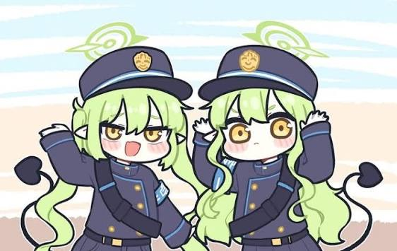

<p align="center">

  

</p>

# Nadenade Hikari

Game berbasis webcam yang terinspirasi dari permainan *whack-a-mole*, dengan konsep **watch-who-you-pet**. Pemain harus menemukan dan menepuk Hikari yang muncul pada berbagai posisi di area permainan.

Pemain menggerakkan tangan kanan di depan webcam untuk mengendalikan cursor. Ketika cursor berada pada target, pemain dapat menekan tombol `Z` untuk melakukan nadenade dan mendapatkan skor.

Program menggunakan webcam dan color tracking berbasis HSV untuk mendeteksi posisi tangan pemain.

Proyek tugas mata kuliah Pengolahan Citra dan Video (PCV).

## Konten

* `main.py` — aplikasi utama: webcam, game loop, dan perpindahan game state.
* `calibration.py` — proses kalibrasi warna untuk menentukan rentang HSV.
* `calibration.json` — batas HSV hasil proses kalibrasi warna.
* `states/game_state.py` — definisi state permainan.
* `states/menu_state.py` — tampilan dan logika menu utama.
* `states/cursor.py` — cursor yang mengikuti posisi tangan hasil deteksi.
* `assets/img/` — gambar Hikari dan aset visual lainnya.
* `assets/audio/` — efek suara dan audio game.

## Test

Aktifkan virtual environment:

```powershell
.\.venv\Scripts\Activate.ps1
```

Jalankan program:

```powershell
python main.py
```

Aplikasi akan membuka webcam dan menjalankan game.

Pada menu utama, pemain dapat menggerakkan tangan kanan untuk mengendalikan cursor.

Cursor dapat digunakan untuk memilih tombol pada menu. Tekan `Z` ketika cursor berada pada tombol yang ingin dipilih.

## Teknologi

| Nama         | Fungsi                                     |
| ------------ | ------------------------------------------ |
| Python 3.13  | Bahasa pemrograman                         |
| OpenCV       | Webcam dan pemrosesan gambar               |
| Pygame       | Game window, rendering, dan input keyboard |
| NumPy        | Pemrosesan data gambar                     |
| Git / GitHub | Version control                            |

## Struktur Game

Game menggunakan sistem state untuk memisahkan menu dan gameplay.

State yang tersedia saat ini:

```text
MENU
  ↓
PLAYING
```

`main.py` bertugas mengatur state aktif, sedangkan masing-masing state memiliki tanggung jawabnya sendiri.

Alur utama program:

```text
main.py
   │
   ├── MENU
   │     ├── menu_state.py
   │     └── cursor.py
   │
   └── PLAYING
         └── game_state.py
```

## Cara Kerja

Pipeline utama program:

```text
Webcam
   ↓
OpenCV
   ↓
Frame Calibration
   ↓
HSV Color Detection
   ↓
Color Mask
   ↓
Hand Position
   ↓
Cursor Position
   ↓
Game Interaction
   ↓
Nadenade
   ↓
Game Response
```

Webcam menampilkan video dalam warna normal pada panel di sebelah kiri layar.

Frame kamera juga diproses dalam ruang warna HSV untuk mendeteksi warna yang telah ditentukan pada proses kalibrasi.

Batas warna hasil kalibrasi disimpan dalam:

```text
calibration.json
```

Contoh data kalibrasi:

```json
{
    "lower_hsv": [
        13,
        89,
        146
    ],
    "upper_hsv": [
        40,
        255,
        229
    ]
}
```

Nilai tersebut digunakan oleh OpenCV untuk membuat mask berdasarkan warna yang terdeteksi.

```text
Camera Frame
      ↓
     HSV
      ↓
   HSV Range
      ↓
   Color Mask
      ↓
Detected Position
```

Posisi hasil deteksi kemudian digunakan untuk menentukan posisi cursor pada layar.

Cursor akan mengikuti pergerakan tangan kanan pemain dan dapat digunakan untuk berinteraksi dengan elemen pada game.

## Gameplay

Gameplay menggunakan konsep **watch-who-you-pet** yang terinspirasi dari *whack-a-mole*.

Hikari akan muncul pada posisi tertentu di area permainan. Pemain harus menggerakkan tangan kanan untuk mengarahkan cursor menuju Hikari.

Ketika cursor berada pada Hikari, pemain dapat menekan:

```text
Z
```

untuk melakukan nadenade.

Konsep permainan juga menggunakan karakter Nozomi sebagai elemen pengganggu. Ketika pemain mencoba melakukan nadenade pada Nozomi, Nozomi dapat memberikan bom yang menjadi bagian dari sistem health permainan.

Alur dasar permainan:

```text
Target muncul
     ↓
Gerakkan tangan kanan
     ↓
Cursor menuju target
     ↓
Tekan Z
     ↓
Target berhasil dinadenade
     ↓
Game memberikan response
```

### Kontrol

| Input        | Fungsi                |
| ------------ | --------------------- |
| Right Hand   | Menggerakkan cursor   |
| `Z`          | Nadenade / interaksi  |
| Window Close | Keluar dari permainan |

## User Interface

Game menggunakan window berukuran:

```text
1280 × 720
```

Panel webcam berada di sebelah kiri, sedangkan area menu dan permainan berada di sebelah kanan.

Camera preview menggunakan rasio 4:3 agar tampilan webcam tidak terdistorsi.

Cursor ditampilkan di atas game window dan mengikuti posisi tangan yang terdeteksi oleh sistem color tracking.

## Progress

### 2026-09-13

* **Inisisasi game** Dikarenakan kurangnya informasi mengenai apakah model MediaPipe diizinkan atau tidak, saya mengulang progres dua minggu dengan membuat project baru tanpa MediaPipe.
* **Project setup.** Membuat project Python, virtual environment, dan struktur folder awal.
* **Color calibration.** Menggunakan HSV color tracking untuk mendeteksi warna yang telah dikalibrasi melalui webcam.
* **Game window.** Membuat window game berukuran 1280×720 menggunakan Pygame.
* **Game state system.** Membuat sistem state untuk memisahkan menu dan gameplay.
* **Main menu.** Membuat menu utama dengan area permainan dan panel webcam.
* **Camera preview.** Menampilkan webcam dalam warna normal dengan rasio 4:3 pada bagian kanan layar.
* **Gameplay concept.** Menentukan konsep permainan berupa whack-a-mole dengan Hikari sebagai karakter yang harus dinadenade.
* Repo ini mengikuti project lama saya sendiri (https://github.com/Kurumicchi/Daitaku-Helios-Simulator) yang seharusnya dijadikan untuk mata kuliah PCV sebelum ada rumor MediaPipe tidak diizinkan

### 2026-09-16
* **Menu layout.** Mengubah layout menu dengan menempatkan panel webcam di sebelah kiri dan area menu di sebelah kanan agar area permainan lebih nyaman digunakan dengan tangan kanan.
* **Hand cursor.** Membuat sistem cursor berbasis posisi tangan yang mengikuti pergerakan tangan kanan pemain pada game window.
* **Cursor interaction.** Menambahkan sistem collision antara cursor dan tombol menu untuk mendeteksi ketika cursor berada di atas tombol.
* **Button hover.** Menambahkan visual state untuk membedakan tombol yang sedang di-hover oleh cursor.
* **Input.** Menambahkan interaksi tombol menggunakan `Z`, sehingga pemain dapat memilih tombol menu menggunakan hand cursor.
* **Cursor module.** Memisahkan logika hand cursor ke dalam `states/cursor.py` agar lebih mudah digunakan kembali pada gameplay.